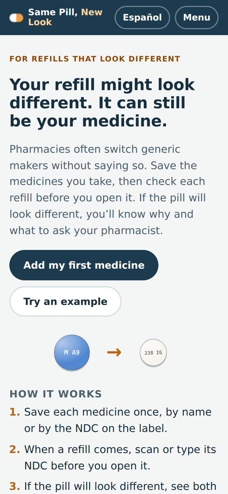
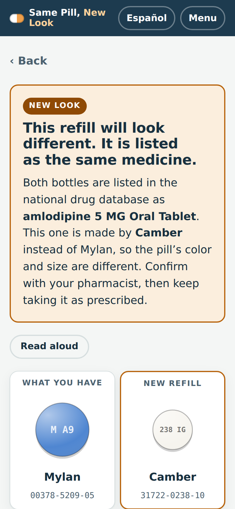
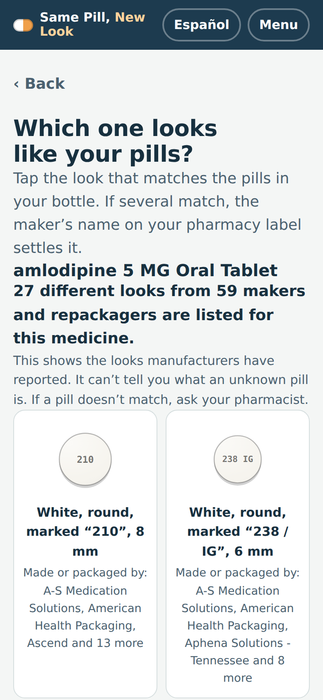
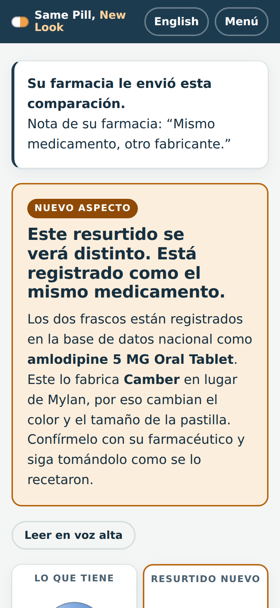

# Same Pill, New Look

Know before you open the bag. Same Pill, New Look tells patients and caregivers when a refill comes from a different generic manufacturer and will look different. That way they check with their pharmacist instead of quietly skipping doses. It works in English and Spanish.

**Live app:** https://perezamadorluisenrique-gif.github.io/same-pill-new-look/

<p>




</p>

## Why

Generics from different makers are interchangeable, but they often look different, and pharmacies switch suppliers without telling anyone.

- In a study of 11,513 heart-attack patients, 29% got a refill whose pill had changed appearance. A shape change raised the odds of stopping the drug by 66% and a color change by 34% ([Kesselheim et al., Annals of Internal Medicine, 2014](https://doi.org/10.7326/M13-2381)).
- In a national survey, 51% of patients had seen a pill change appearance, and 12% of those stopped or cut back on the drug. 82% wanted to be told in advance, but only 36% remembered being told by a pharmacist and 45% remembered a sticker ([Barenie et al., American Journal of Managed Care, 2020](https://www.ajmc.com/view/preferences-for-and-experiences-with-pill-appearance-changes-national-surveys-of-patients-and)).
- FDA guidance asks that generics be similar in size and shape to the brand, but it does not require the same color ([FDA, 2015](https://www.fda.gov/regulatory-information/search-fda-guidance-documents/size-shape-and-other-physical-attributes-generic-tablets-and-capsules)).
- NLM's live data lists 29 different looks for amlodipine 5 mg tablets, from more than 50 makers and repackagers. The app shows all of them.

## What it does

1. **Save what you take.** Search by name and pick the pill that looks like yours from every listed look. Or type or scan the NDC (National Drug Code) from the label. The app shows the maker, color, shape, imprint and size.
2. **Check each refill before opening it.** Scan or type the new bottle's code. The app matches it to your saved medicine by its RxNorm clinical drug (ingredient, strength and form) and compares the two.
   - **New look:** same medicine, new maker, and a different color, shape, imprint or size. Both pills are shown side by side, and the result says in plain words what changed.
   - **New maker:** same medicine, and the listed look matches.
   - **Same as before:** same product code.
   - **Doesn't match:** a different medicine. The app says not to take it until you've talked to your pharmacist.
3. **Recall check.** Every saved medicine and every refill is checked against FDA drug recalls (openFDA). Only recalls whose text names that exact product code count, so a recall of a different strength doesn't raise a false alarm.
4. **Ask your pharmacist.** A ready-to-send message names both makers, both NDCs and both looks. You can also have it read aloud.
5. **For pharmacies.** A pharmacy can type the old and new NDC and an optional note to get a link and a printable QR sticker for the bag. The patient scans it and sees the comparison in their own language, with no app and no account.
6. **Pill chart.** A printable chart shows what each medicine should look like now, for the pill organizer. Confirmed refills keep a history of past looks.

It also has a few other features:

- Caregiver mode, where each medicine can say who takes it.
- Large text.
- Backup to a file and restore.
- Erase everything.
- Install as an app, and work offline for everything except new lookups.

**Try an example** loads real recorded data for three medicines and a recalled product, so you can see every screen without typing a code.

## Safety framing

This app does not identify pills. NLM asks that its appearance data not be used to identify pills, and the data is self-reported by manufacturers. Every message is framed as "your refill comes from a new manufacturer, confirm with your pharmacist", never "this pill is safe".

## Privacy

There is no account and no server. The medicine list lives in the browser's local storage on the device. Lookups go straight from the browser to `rxnav.nlm.nih.gov` and `api.fda.gov` and carry only a product code or drug name. Pharmacy links carry the two NDCs and the optional note in the URL, and nothing personal. Visits are counted with [GoatCounter](https://www.goatcounter.com/) (`stats.js`): no cookies, nothing stored on the device, no personal data. It sends only the page path (never the query string, so shared links and anything typed stay private), the referring site and the screen width, and it is skipped when Do Not Track is on.

## How it works

It is a static site with no build step:

| File | Role |
| --- | --- |
| `core.js` | NDC parsing (hyphenated, 10/11-digit, UPC-A, EAN-13, GTIN-14, GS1 DataMatrix), RxNav and openFDA lookups, comparison, look grouping, share links, pill drawing. Pure functions, tested in Node. |
| `i18n.js` | Every string in English and Spanish, including color and shape words with Spanish gender agreement. |
| `app.js` | The page: router, views, local storage, barcode scanning, recalls, QR stickers, read-aloud, backups, example mode. |
| `examples.js`, `example-data.json` | Example mode answers from real recorded RxNav and openFDA responses. |
| `sw.js`, `manifest.webmanifest` | Installable, offline app shell. |
| `vendor/zxing-0.21.3.min.js` | Barcode decoding where the browser has no `BarcodeDetector` (iOS Safari). Apache-2.0. |
| `vendor/qrcode-generator-2.0.4.js` | QR codes for pharmacy stickers. MIT. |

It uses these data sources, all of which allow calls from the browser:

- RxNav [`getNDCProperties`](https://lhncbc.nlm.nih.gov/RxNav/APIs/api-RxNorm.getNDCProperties.html) for maker, color, shape, imprint, size and the DailyMed set id. Shape and color come back as FDA SPL codes (for example `C48348` is round), which `core.js` maps to words.
- RxNav `getDrugs`, `getSpellingSuggestions`, `getRxConceptProperties` and `getRelatedByType` for name search and for mapping brands to their clinical drug.
- [openFDA drug enforcement](https://open.fda.gov/apis/drug/enforcement/) for recalls.
- DailyMed label links for official photos.

A bare 10-digit NDC can be read three ways (4-4-2, 5-3-2, 5-4-1). The app asks for all three, and if more than one is a real product it asks the user to pick the maker on their bottle.

## Testing

- `npm test` runs the unit tests in Node against `test/fixtures/recorded.json`, which holds 75 real API responses recorded by a GitHub Action (`scripts/record-fixtures.mjs`, run by pushing to the `fixtures` branch).
- `npm run e2e` drives the real page in Chromium through 10 journeys:
  - add by name
  - check a refill by UPC
  - confirm a refill
  - recall
  - Spanish
  - pharmacy QR and shared link
  - every-look gallery
  - settings
  - dark-mode example

  The run checks for horizontal overflow at phone width and runs axe accessibility checks. Every network call is answered from the fixtures.
- **Live check** (`.github/workflows/smoke.yml`) runs `test/smoke.mjs` against the published site and the real APIs every day and after each deploy.

## Run it

```sh
npm install
npm test           # unit tests, Node 18+
npm run e2e        # browser tests (needs Playwright's Chromium)
npm start          # serves on http://localhost:8080
```

Pushing to `main` runs both test suites and then publishes the site to the `gh-pages` branch, which GitHub Pages serves.

## Ideas for next steps

- Pharmacy systems could send the "your next refill will look different" link automatically when the dispensed NDC changes.
- Medicare Advantage plans track adherence through star ratings, so they could offer this to members.
- More languages (Chinese, Vietnamese, Tagalog are the next most common at U.S. pharmacies).

## Credits

This product uses publicly available data from the U.S. National Library of Medicine (NLM), National Institutes of Health, Department of Health and Human Services; NLM is not responsible for the product and does not endorse or recommend this or any other product. Recall data comes from openFDA; FDA does not endorse this product.

MIT licensed. See `LICENSE`.
